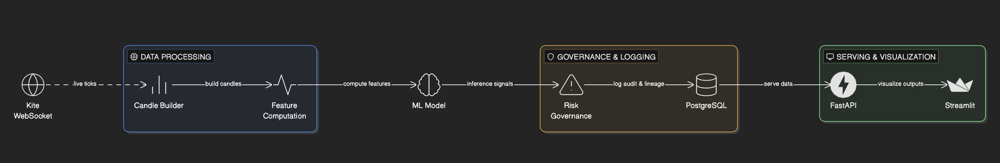

# TradeIQ Realtime Signal Platform

SEBI-aware local research platform for Indian market signal analytics.

## 1. What This Project Is

This repository provides an end-to-end **local** pipeline that:
- consumes live market ticks from Kite WebSocket,
- builds 15-minute and daily candles,
- computes technical features,
- runs ML model inference to generate BUY/SELL/HOLD research signals,
- applies simulation-only risk governance,
- stores full audit trails and prediction lineage in PostgreSQL,
- serves data via FastAPI,
- visualizes outputs in Streamlit.

## 2. Scope and Explicit Non-Goals

### Included
- Real-time ingestion from Kite WebSocket.
- Historical pull from Kite for training.
- Signal generation only (no execution).
- Model versioning and explainability payload.
- Compliance-safe logging and audit storage.

### Excluded
- Automatic order placement.
- Broker execution orchestration.
- Cloud deployment and containerization (current mode is local-first).

## 3. High-Level Architecture



```text
Kite WebSocket ticks
    -> TickHandler (thread-safe queue)
    -> CandleAggregator (15m + 1d)
    -> FeaturePipeline (indicators + feature row)
    -> predict_signal() using active model
    -> RiskManager guardrails (simulation)
    -> PostgreSQL writes (candles/predictions/audit/risk/heartbeat)
    -> FastAPI endpoints
    -> Streamlit dashboard polling API
```

## 4. Repository Layout (Micro-Level)

```text
api/
  main.py                     # FastAPI app, startup/shutdown hooks, engine control APIs

compliance/
  disclaimer.py               # SEBI disclaimer text + version constant
  risk_manager.py             # Simulation-only risk controls (throttle/drawdown/sizing/SL)
  compliance_design.md        # Compliance design rationale

config/
  config.py                   # Settings dataclass + env loading + utility loaders
  instruments.json            # instrument_token -> symbol map used by realtime ingestion
  market_holidays.json        # optional holiday list (YYYY-MM-DD)

data/
  kite_client.py              # Kite websocket client + historical client wrappers
  tick_handler.py             # websocket callback normalizer + bounded queue
  candle_aggregator.py        # thread-safe 15m/1d candle assembly from ticks

database/
  schema.sql                  # full PostgreSQL DDL
  db_manager.py               # insert/query/upsert helpers used by engine/API/training

features/
  indicators.py               # indicator computations (MACD/RSI/ATR/BB/volatility/etc.)
  feature_pipeline.py         # selected feature columns + latest-row extraction

models/
  train.py                    # train/retrain from Kite historical data
  predict.py                  # probability + signal + explainability logic
  model_registry.py           # model metadata registry + local fallback artifact lookup
  artifacts/                  # generated .pkl and .meta.json model files

realtime/
  realtime_engine.py          # async orchestration loop for live processing

dashboard/
  streamlit_app.py            # user-facing local dashboard

scripts/
  generate_kite_token.py      # helper for daily Kite access-token generation
```

## 5. Runtime Sequence (Step by Step)

### 5.1 API Startup (`api/main.py`)
1. `DatabaseManager().init_schema()` runs DDL idempotently.
2. If `AUTO_START_ENGINE=true`, `RealtimePredictionEngine.start()` is invoked.

### 5.2 Engine Startup (`realtime/realtime_engine.py`)
1. Add rotating log sink at `LOG_PATH`.
2. Load token-symbol map from `config/instruments.json`.
3. Resolve instrument token list (`settings.instrument_tokens` or map keys).
4. Load active model for each timeframe (`15m`, `1d`) from DB registry.
5. Warm in-memory candle history from DB (`ohlcv_candles`).
6. Start Kite websocket client in threaded mode.
7. Insert compliance audit event `engine_start`.
8. Launch async tasks:
   - `_consume_ticks_loop`
   - `_heartbeat_loop`

### 5.3 Tick Consumption
1. Drain queue in batches (`max_batch_size=1500`).
2. Persist ticks to `realtime_ticks`.
3. Pass each tick into `CandleAggregator.process_tick()`.
4. For each closed candle returned:
   - upsert candle,
   - compute latest feature row,
   - run model inference,
   - apply risk controls,
   - write prediction + audit (+ optional risk event).

### 5.4 Heartbeat
Every 15 seconds, write `engine_heartbeat` with:
- websocket connection status,
- dropped queue tick count,
- loaded model timeframes.

## 6. Data Contracts

### 6.1 Normalized Tick (`data/tick_handler.py`)
`NormalizedTick` fields:
- `instrument_token`
- `symbol`
- `ts`
- `last_price`
- `last_traded_quantity`
- `total_buy_quantity`
- `total_sell_quantity`
- `volume`
- `oi`
- `source` (`kite_ws`)

### 6.2 Candle (`data/candle_aggregator.py`)
`Candle` fields:
- `symbol`, `timeframe`, `candle_start`, `candle_end`
- `open`, `high`, `low`, `close`
- `volume`, `tick_count`, `is_partial`

### 6.3 Prediction Payload
Stored in `prediction_events`:
- symbol/timeframe timestamps (`prediction_ts`, `target_ts`)
- signal + probabilities + confidence
- model name/version
- `feature_snapshot` JSON
- `explainability` JSON
- `risk_snapshot` JSON
- compliance note + `is_simulated`

## 7. Feature Engineering Details

Source: `features/indicators.py` and `features/feature_pipeline.py`

### 7.1 Selected Model Features (`FEATURE_COLUMNS`)
- `ret_1`, `ret_3`, `ret_5`, `ret_15`
- `macd`, `macd_signal`, `macd_hist`
- `rsi_14`
- `atr_pct`
- `volatility_20`
- `volume_zscore_20`
- `bb_width`
- `session_progress`, `minute_sin`, `minute_cos`

### 7.2 Derived Indicators (also available for charting)
- EMA(12), EMA(26), MACD family
- RSI(14)
- ATR(14) and normalized ATR%
- Bollinger bands width
- rolling volatility and volume z-score

### 7.3 Training Target
`target_up = close(t+1) > close(t)` (binary next-candle direction).

## 8. Model Lifecycle

### 8.1 Training (`models/train.py`)
- Data source: Kite historical API.
- Time split: first 80% train, last 20% test.
- Model priority:
  - `XGBClassifier` if available,
  - fallback `RandomForestClassifier`.
- Metrics: accuracy, precision, recall, f1, roc_auc (if possible).
- Walk-forward: periodic rolling fit/predict for stability estimate.

### 8.2 Minimum Rows Gate
- `15m` default minimum rows: `200`
- `1d` default minimum rows: `40`
- override with `--min-rows`

### 8.3 Versioning + Registry
- Artifact naming: `{symbol}_{model_name}_{timeframe}_{version}.pkl`
- Metadata file: `.meta.json`
- DB registry table: `model_registry`

## 9. Signal Generation Logic

Source: `models/predict.py`

### 9.1 Probability Extraction
- use `predict_proba` if available,
- else logistic transform on `decision_function`,
- else clipped numeric prediction fallback.

### 9.2 Signal Mapping
- `BUY` if `prob_up >= SIGNAL_BUY_THRESHOLD` (default 0.6)
- `SELL` if `prob_up <= SIGNAL_SELL_THRESHOLD` (default 0.4)
- otherwise `HOLD`

### 9.3 Confidence
`confidence = max(prob_up, prob_down)`

### 9.4 Explainability
Top-k (default 8) contribution proxy using:
- feature importances (tree models), or
- absolute coefficients (linear models), or
- equal weights fallback.

## 10. Risk & Governance Layer

Source: `compliance/risk_manager.py`

Controls are simulation-only and can downgrade any model signal to `HOLD`:
- signal cooldown throttling (`SIGNAL_COOLDOWN_SECONDS`)
- drawdown cap (`MAX_DRAWDOWN_PCT`)
- max allocation cap (`MAX_CAPITAL_ALLOCATION_PCT`)
- stop-loss simulation (`STOP_LOSS_PCT`)

Risk outputs are stored in `prediction_events.risk_snapshot` and `risk_events`.

## 11. Database Schema Overview

Defined in `database/schema.sql`.

### Core tables
- `realtime_ticks`: raw normalized ticks
- `ohlcv_candles`: candle store for `1m/5m/15m/1h/1d`
- `prediction_events`: complete signal event log
- `model_registry`: active model metadata
- `simulated_backtest_metrics`: training/backtest snapshots
- `risk_events`: governance exceptions/guardrail triggers
- `compliance_audit_trail`: lifecycle/audit event log
- `engine_heartbeat`: runtime liveness and health details

### Important indexes/constraints
- unique `(symbol, timeframe, candle_start)` for candles
- prediction index on `(symbol, timeframe, prediction_ts DESC)`
- model uniqueness on `(model_name, timeframe, version)`

## 12. FastAPI Endpoints

Source: `api/main.py`

- `GET /health`
- `GET /kite/auth-check`
- `GET /compliance/disclaimer`
- `POST /engine/start`
- `POST /engine/stop`
- `GET /signals/latest?limit=...`
- `GET /signals/history?symbol=...&timeframe=1m|5m|15m|1h|1d&limit=...`
- `GET /candles?symbol=...&timeframe=1m|5m|15m|1h|1d&limit=...`
- `GET /backtest/latest?symbol=...&timeframe=15m|1d`
- `POST /historical/backfill?symbol=...&timeframe=1m|5m|15m|1h|1d&days=30`

## 13. Dashboard Behavior

Source: `dashboard/streamlit_app.py`

Shows:
- SEBI disclaimer and risk disclosure (from API)
- symbol/timeframe/candle count/refresh controls
- one-click historical backfill control in UI
- live candlestick chart with EMA12/EMA26 overlays
- current prediction + confidence + prob_up + model version
- historical signal table
- latest simulated backtest metrics

Note:
- model inference is currently configured for `15m` and `1d`.
- `1m/5m/1h` are available as candle streams and chart timeframes.
- to enable prediction on additional frames, train those models and set `MODEL_TIMEFRAMES` (e.g. `1m,5m,15m,1h,1d`).

Polling model:
- pulls from API every `Refresh` seconds (or disabled with `0`).

## 14. Configuration Reference

Source: `config/config.py` and `.env.example`

### Required
- `DATABASE_URL`
- `KITE_API_KEY`
- `KITE_ACCESS_TOKEN`

### Common optional
- `AUTO_START_ENGINE` (default `true`)
- `LOG_PATH`
- `KITE_SUBSCRIBE_MODE` (default `full`)
- `CANDLE_TIMEFRAMES` (default `1m,5m,15m,1h,1d`)
- `MODEL_TIMEFRAMES` (default `15m,1d`)
- `SIGNAL_BUY_THRESHOLD`, `SIGNAL_SELL_THRESHOLD`
- `SIGNAL_COOLDOWN_SECONDS`
- `MAX_CAPITAL_ALLOCATION_PCT`, `STOP_LOSS_PCT`, `MAX_DRAWDOWN_PCT`
- `SYMBOL_TOKEN_MAP_FILE` (default `config/instruments.json`)
- `MARKET_HOLIDAY_FILE` (default `config/market_holidays.json`)
- `PARTIAL_MARKET_CLOSES_JSON` (default `{}`)

### Files
- `config/instruments.json`: token-symbol map used for subscriptions
- `config/market_holidays.json`: `[]` or list of holiday dates

## 15. Local Setup (End-to-End)

## 15.1 Prerequisites
- Python 3.11+ (tested by you on 3.13/3.14)
- PostgreSQL local instance
- Paid Kite Connect subscription and valid credentials

### 15.2 Install
```bash
cd /Users/rohkumaw/Documents/stock_market_ai
python3 -m venv .venv
source .venv/bin/activate
pip install -r requirements.txt
```

### 15.3 Database
```bash
brew services start postgresql
createuser -s rohkumaw 2>/dev/null || true
createdb -O rohkumaw stock_market_ai 2>/dev/null || true
```

Set DB URL (recommended to avoid localhost/GSS issues):
```bash
export DATABASE_URL='postgresql+psycopg2://rohkumaw@127.0.0.1:5432/stock_market_ai?gssencmode=disable'
```

### 15.4 Kite Token (daily refresh)
1. Print login URL:
```bash
python3 scripts/generate_kite_token.py --api-key YOUR_API_KEY --print-login-url
```
2. Login, capture `request_token` from redirect URL.
3. Generate and export access token:
```bash
python3 scripts/generate_kite_token.py \
  --api-key YOUR_API_KEY \
  --api-secret YOUR_API_SECRET \
  --request-token YOUR_REQUEST_TOKEN

export KITE_API_KEY='YOUR_API_KEY'
export KITE_ACCESS_TOKEN='YOUR_ACCESS_TOKEN'
```

### 15.5 Instrument Map
Edit `config/instruments.json`, example:
```json
{
  "738561": "RELIANCE"
}
```

### 15.6 Initialize Schema
```bash
python3 -c "from database.db_manager import DatabaseManager; DatabaseManager().init_schema(); print('schema ok')"
```

### 15.7 Train Models
```bash
python3 -m models.train --symbol RELIANCE --instrument-token 738561 --timeframe 15m --lookback-days 240
python3 -m models.train --symbol RELIANCE --instrument-token 738561 --timeframe 1d --lookback-days 720
```

Optional intraday variants:
```bash
python3 -m models.train --symbol RELIANCE --instrument-token 738561 --timeframe 1m --lookback-days 30
python3 -m models.train --symbol RELIANCE --instrument-token 738561 --timeframe 5m --lookback-days 120
python3 -m models.train --symbol RELIANCE --instrument-token 738561 --timeframe 1h --lookback-days 365
```

If daily data is sparse:
```bash
python3 -m models.train --symbol RELIANCE --instrument-token 738561 --timeframe 1d --lookback-days 720 --min-rows 40
```

### 15.8 Run Services
Terminal 1:
```bash
uvicorn api.main:app --host 127.0.0.1 --port 8000 --reload
```

Terminal 2:
```bash
streamlit run dashboard/streamlit_app.py
```

Optional: backfill historical candles (outside market hours or for immediate charts):
```bash
curl -X POST \"http://127.0.0.1:8000/historical/backfill?symbol=RELIANCE&timeframe=1m&days=10\"
curl -X POST \"http://127.0.0.1:8000/historical/backfill?symbol=RELIANCE&timeframe=5m&days=30\"
curl -X POST \"http://127.0.0.1:8000/historical/backfill?symbol=RELIANCE&timeframe=15m&days=90\"
curl -X POST \"http://127.0.0.1:8000/historical/backfill?symbol=RELIANCE&timeframe=1h&days=120\"
curl -X POST \"http://127.0.0.1:8000/historical/backfill?symbol=RELIANCE&timeframe=1d&days=365\"
```

## 16. Daily Operator Checklist

1. Activate venv.
2. Refresh Kite access token.
3. Export env vars in the same terminal used to run services.
4. Ensure DB is running.
5. Start API/engine.
6. Start dashboard.
7. Confirm `/health` and incoming candles/signals.

## 17. Troubleshooting Playbook

### Error: `TokenException: Incorrect api_key or access_token`
- refresh `KITE_ACCESS_TOKEN` (token expired or mismatched app key).
- ensure key/token belong to same Kite app.

### Error: `Failed to resolve api.kite.trade`
- DNS/network issue on host, not model code.
- verify with `nslookup api.kite.trade`.

### Error: `role "postgres" does not exist`
- your local Postgres role differs.
- use your actual role in `DATABASE_URL`.

### Error: `No module named 'features'` (dashboard)
- fixed in code by injecting project root into `sys.path`.
- still run Streamlit from project root.

### `No candle data available` in dashboard
- market closed, no closed candles yet, or token-symbol mismatch.
- check `config/instruments.json` and API logs.
- run `/historical/backfill` for the selected symbol/timeframe to preload candles.

### `Insufficient rows for training ...`
- increase `--lookback-days` or lower `--min-rows`.
- verify you used correct instrument token for symbol.

## 18. Compliance Mapping (Quick)

- Disclaimer source: `compliance/disclaimer.py`
- Detailed compliance notes: `compliance/compliance_design.md`
- Signal-only architecture: no execution module present
- Prediction lineage: `prediction_events`
- Audit trail: `compliance_audit_trail`
- Simulated labeling: `simulated_backtest_metrics.is_simulated` and dashboard labeling

## 19. Known Gaps / Next Engineering Priorities

1. Add explicit API/DB integration tests.
2. Add Kite rate-limit aware historical chunking helper.
3. Add structured alerting on heartbeat and ingestion stalls.
4. Add stronger explainability (SHAP) for tree models.
5. Add multi-symbol training orchestration and model selection policy.

## 20. Database Housekeeping (Archive Legacy Tables)

Use the archive utility to keep `public` schema clean without dropping old tables.

Dry run:
```bash
python3 scripts/archive_legacy_tables.py --database-url \"$DATABASE_URL\" --dry-run
```

Execute archive move:
```bash
python3 scripts/archive_legacy_tables.py --database-url \"$DATABASE_URL\" --execute
```

Behavior:
- keeps active realtime tables from `database/schema.sql` in `public`
- moves other `public` tables to a timestamped schema like `backup_archive_YYYYMMDD_HHMMSS`
- non-destructive: data remains queryable in backup schema

## 21. License / Usage

Internal research project template. Ensure legal/compliance review before external user distribution.
